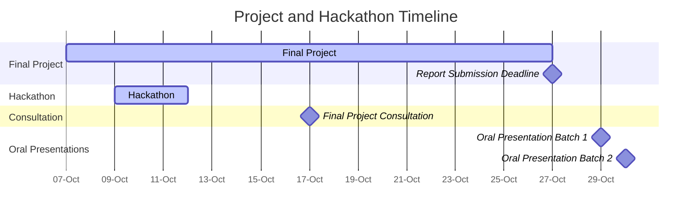

<!-- updated: 14.09.2024 -->

**Start date**: Week 41 (7th October 2024)

### Final Project

The final project allows students to showcase their learning by proposing their own dataset and project idea. This open-ended assignment encourages participants to explore topics of interest within data-driven life science and apply the skills gained throughout the course in groups of 2 - 3 students.

**Project Requirements**:
- Students are required to submit a proposal for approval before beginning their project.
- Proposals should reflect challenging and engaging work that integrates course content.

**Project Proposal Structure**:
- Include the names of all group members (one proposal per group)
- Title of the project
- Dataset to be used and its source
- Abstract of the project, including motivation and course concepts to be applied
- Maximum of one page

**Submit Your Proposal (opens in week 38)**:

- **Deadline:** Proposals should be submitted before the final project starts, it will be **6th October 2024**.



**[Timeline](../schedule/)**:

- Final Project: 7th - 27th October 2024
- Hackathon: 9th - 11th October 2024
- Final Project Consultation: 17th October, 08:00-11:00 CEST
- Final Project Report Submission Deadline: Sunday, 27th October 2024, 23:59 CEST
- Oral Presentation (Batch 1): Tuesday, 29th October 2024, 08:00-10:00 CEST (Master's students)
- Oral Presentation (Batch 2): Wednesday, 30th October 2024, 08:00-10:00 CEST (Master's students)

### Hackathon (Optional)

We invite you to participate in the **DDLS Hackathon**, an event designed to foster collaboration and innovation in data-driven life science. Participation is **not mandatory** and can be either **online or in person**.

**Purpose of the Hackathon**:

-   Collaborate with peers and experts in a hands-on environment
-   Enhance your final project through teamwork and support from teaching assistants
-   Explore new ideas and apply course concepts to real-world problems

For more details and to sign up, please visit the **[Hackathon page](../hackathon/)**.