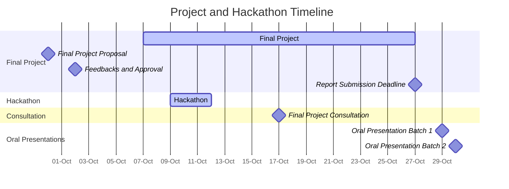

<!-- updated: 14.09.2024 -->

**Start date**: Week 41 (7th October 2024)

### Final Project

The final project allows students to showcase their learning by proposing their own dataset and project idea. This open-ended assignment encourages participants to explore topics of interest within data-driven life science and apply the skills gained throughout the course by yourself or in a pair of two student (at the same level, e.g. both are master students).

**Project Requirements**:
- Students are required to submit a proposal for approval before beginning their project.
- **Each group should submit only one proposal.**
- Proposals should reflect challenging and engaging work that integrates course content.

### Project Proposal Submission:

**Format:**

- Maximum of one page
- File format: PDF

**Structure:**

- Include your name or the two group member names (in case of a pair)
- Title of the project
- Dataset to be used and its source
    - make sure you have tested the data availability
    - make sure the data is suitable for the project idea
    - make sure the data is not too small or too big to be handled in the given time frame
- Abstract of the project, including motivation and course concepts to be applied
    - Include the motivation for the project
    - Describe the idea and the problem you want to solve
    - Explain how you plan to solve the problem (including the course concepts you will apply)
    - Describe the expected outcome

**Submit Your Proposal (opens in week 38)**:

- **Submission Deadline:** **30th September 2024**.



After the deadline, the teaching team will review the proposals and provide feedback on 2024-10-02 during the computer lab. Once approved, students can begin working on their projects.

**[Timeline](../schedule/)**:

- Final Project: 7th - 27th October 2024
- Hackathon: 9th - 11th October 2024
- Final Project Consultation: 17th October, 08:00-11:00 CEST
- Final Project Report Submission Deadline: Sunday, 27th October 2024, 23:59 CEST
- Oral Presentation (Batch 1): Tuesday, 29th October 2024, 08:00-10:00 CEST (Master's students)
- Oral Presentation (Batch 2): Wednesday, 30th October 2024, 08:00-10:00 CEST (Master's students)

### Hackathon (Optional)

To promote in-person team work and knowledge exchange, we invite you to participate in the **DDLS Hackathon**, an event designed to foster collaboration and innovation in data-driven life science. Participation is **not mandatory** and can be either **online or in person** (registration is required in advance!).

For more details and to sign up, please visit the **[Hackathon page](../hackathon/)**.