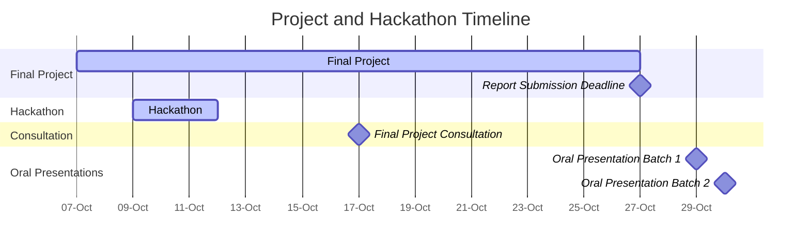

<!-- updated: 14.09.2024 -->

**Start date**: Week 41 (9th October 2024)

### Final Project

The final project allows students to showcase their learning by proposing their own dataset and project idea. This open-ended assignment encourages participants to explore topics of interest within data-driven life science and apply the skills gained throughout the course in groups of up to 3 students.

**Project Requirements**:
- Students are required to submit a proposal for approval before beginning their project.
- Proposals should reflect challenging and engaging work that integrates course content.

**Project Proposal Structure**:
- Include the names of all group members (one proposal per group)
- Title of the project
- Dataset to be used and its source
- Abstract of the project, including motivation and course concepts to be applied
- Maximum of one page

**Submit Your Proposal (opens in week 38)**:



**[Timeline](../schedule/)**:

- Final Project: 7th - 27th October 2024
- Hackathon: 9th - 11th October 2024
- Final Project Consultation: 17th October, 08:00-11:00 CEST
- Final Project Report Submission Deadline: Sunday, 27th October 2024, 23:59 CEST
- Oral Presentation (Batch 1): Tuesday, 29th October 2024, 08:00-10:00 CEST (Master's students)
- Oral Presentation (Batch 2): Wednesday, 30th October 2024, 08:00-10:00 CEST (Master's students)

### Hackathon

Join us at the **DDLS Hackathon in person or online**, where participants will collaborate on their projects. With the support of teaching assistants in a hands-on environment, groups will develop solutions in the dynamic field of data-driven life science.

This hackathon is part of the [2024 DDLS course](https://ddls.aicell.io/course/ddls-2024/) and will bring together data-driven life science researchers, including MSc students, PhD students, postdocs, staff-scientists, experts, and group leaders.

Course participants will use the skills and knowledge gained during the course to create AI models, analyze data, and generate meaningful insights. Everyone affiliated with the DDLS program or interested in data-driven life science is also welcome to join, including PIs, PhD students, postdocs, and facility experts/trainers. 

Participants will form small groups of 2-3 people on-site to work on projects, exchange ideas and experiences, and engage in pair programming. This collaborative environment will foster innovation and provide a unique opportunity to apply the concepts learned throughout the course to real-world problems.

**What will you gain by attending the hackathon?**
- Hands-on experience with a data-driven life science project
- Networking opportunities with experts, researchers, and infrastructure specialists in the field

### Join In Person

For those who plan to join **in person**, please register using the form linked below to help us manage room arrangements, catering, and other logistics. Lunch boxes and fika will be provided on-site to keep you energized throughout the event.

- **Where:** SciLifeLab Solna, Building Gamma, Floor 7, Lunchroom
- **Application Link:**



- **Application Deadline:** Monday, 30th September 2024

For questions, contact Wei Ouyang at <weio@kth.se> or <traininghub@scilifelab.se>.