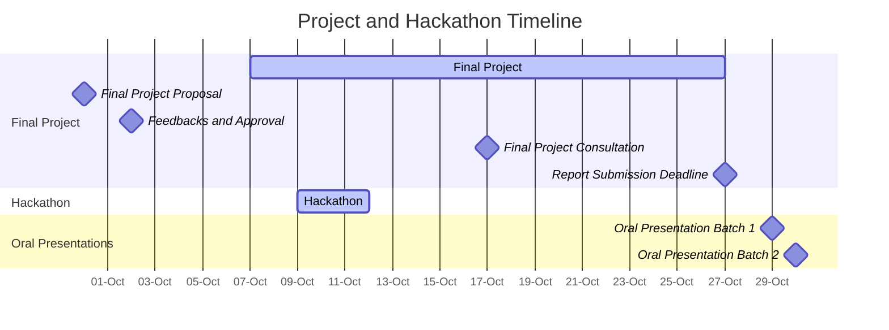

<!-- updated: 14.09.2024 -->

**Start date**: Week 41 (7th October 2024)

### Final Project

The final project allows students to showcase their learning by proposing their own dataset and project idea. This open-ended assignment encourages participants to explore topics of interest within data-driven life science and apply the skills gained throughout the course individually or in a pair (both members should be at the same level, e.g., both Master’s students).

**Project Requirements**:

- Submit a proposal for approval before beginning your project.
- Every student must submit an individual proposal. If you are working in a pair, each member must submit a proposal with their distinct contribution.
- Proposals should reflect challenging and engaging work that integrates course content.

### Project Proposal Submission:

**Format:**

- Maximum of one page
- File format: PDF

**Structure:**

- Include your name (or both names if working as a pair)
- Title of the project
- Dataset to be used and its source
    - Ensure that the dataset availability has been tested
    - Verify that the dataset is suitable for the project idea
    - Ensure that the dataset is neither too small nor too large to be handled in the given timeframe
    - If using a private dataset, include its size and details on how it will be accessed
- Abstract of the project, including motivation and course concepts to be applied:
    - Motivation for the project
    - Describe the idea and the problem you aim to solve
    - Explain how you plan to solve the problem (including which course concepts will be applied)
    - Describe the expected outcome

**Submit Your Proposal (opens in week 38)**:

- **Submission Deadline**: **30th September 2024**.



The teaching team will review the proposals and provide feedback on 2nd October 2024, during the computer lab. Once your proposal is approved, you can begin working on your project.

### Working on your project

Once you revised your proposal based on the feedback, you can start working on your project. The final project should be completed by **27th October 2024**. You will have the opportunity to consult with the teaching team during the hackathon (9th-11th October 2024) or on **17th October 2024**.

For complete the project, you need to submit a project report and present your project together.

While working on the project, please take notes and update your project report. For master students, save figures and results to slides which you will use for the final presentation.

**FAIR Data and Open Science Recommendations:**

To promote the **FAIR** (Findable, Accessible, Interoperable, Reusable) principles, we encourage the use of public datasets. If you are working with a private dataset, consider how you might make it publicly available in the future.

We also encourage you to support open science by making your project code publicly available on GitHub or GitLab. If you have a valid reason not to share your code publicly, please indicate this in your submission. We recommend that:
1. **Create a GitHub/GitLab repository**.
    - On GitHub, add the topic `ddls-course-2024` to make your project findable ([GitHub Topics Guide](https://docs.github.com/en/repositories/managing-your-repositorys-settings-and-features/customizing-your-repository/classifying-your-repository-with-topics)).
2. **Include a README file** with an overview of the project and instructions on how to use the code.
3. **Document your code** properly.
4. **Include a permissive license** (e.g., MIT license) to allow others to reuse your code.
5. **If a public dataset was used**, provide a script or instructions for downloading the dataset properly.
6. **Make your code reproducible**, and if there are trained model weights, try to upload them to GitHub Releases or Zenodo.
7. **If possible, make your final report public**, for example, by uploading it to Zenodo.

### Final Project Report Submission

After completing your project, you will need to submit a final report by **27th October 2024**. 

The report should be a maximum of **5 pages** for the main text and unlimited supplementary pages, consider include the following sections in the report:
- **Abstract**: Summarize the project, including the problem, method, and results. Maximum 100 words.
- **Background and Motivation**: Describe the problem you aimed to solve and the motivation behind your project.
- **Dataset Summary**: Provide a brief overview of the dataset used, including how it was generated, any preprocessing steps taken, split of training and test data, distribution of classes, etc.
- **Method Description**: Explain the method you implemented, e.g. the model architecture, training procedure, evaluation metrics, etc.
- **Results**: Present your results with figures and tables, show the performance of your model, e.g., accuracy, F1 score, etc. compared to the baseline or other methods.
- **Conclusion and Discussions**: Summarize your findings and reflect on the project's outcomes, potential application. Discuss the limitations and drawbacks of your work. Suggest potential improvements or future directions.
- **Data and Code Availability**: Include links to your dataset and code repository (if applicable), see the FAIR Data and Open Science Recommendations above.
- **Acknowledgments**: Acknowledge any contributions or support received during the project. Here you can also state whether you used ChatGPT or other AI tools. If you used ChatGPT, please include the conversation history link.
- **References**: Include any references used in your report.
- **Appendices**: Include any supplementary information, such as additional figures, tables, or implementation details.

**If you are in a group**: Each member should submit an individual report detailing their distinct contribution to the project.

**Note on ChatGPT**:

You are encouraged to use ChatGPT for help your coding and report writing. However, please make sure you use it responsibly and stick to the course rules regarding its use, see [AI in Life Sciences: Power with Responsibility](https://ddls.aicell.io/post/responsible-ai/).

**Submit Your Final Report**:

 - **Submission Deadline**: **27th October 2024, 23:59 CEST**.

 - **Submission form will be available soon.**

### Oral Presentation

The oral presentation is mandatory for Master's students and optional for PhD students. The presentation will take place on **29th and 30th October 2024**. You will have 10 minutes to present your project, followed by a 5-minute Q&A session.

---

**[Timeline](../schedule/)**:

- Final Project: 7th - 27th October 2024
- Hackathon: 9th - 11th October 2024
- Final Project Consultation: 17th October, 08:00-11:00 CEST
- Final Project Report Submission Deadline: Sunday, 27th October 2024, 23:59 CEST
- Oral Presentation (Batch 1): Tuesday, 29th October 2024, 08:00-10:00 CEST (Master's students)
- Oral Presentation (Batch 2): Wednesday, 30th October 2024, 08:00-10:00 CEST (Master's students)

---

### Project Evaluation Criteria:

During the evaluation of your final project, several factors will be considered:
- **Completion of the project**: While completing the project is important, it is not the only criterion.
- **Learning and use of new tools**: We will also evaluate your ability to gain new knowledge and apply new techniques or tools learned during the course.
- **Sound methodology**: Even if your model does not perform well, demonstrating a technically sound approach is critical.
- **Proper use of tools (e.g., ChatGPT)**: If you used AI tools, we expect to see that you have understood how to use them effectively, as reflected in your work (including, for example, your ChatGPT history).

You are responsible for ensuring the success of your project. If you encounter challenges, please reach out for advice or feedback.

---

### Hackathon (Optional):

We invite you to participate in the **DDLS Hackathon**, which fosters teamwork and innovation in data-driven life science. The hackathon will take place from 9th to 11th October 2024 and is optional. You can participate **online or in person**, but prior registration is required.

For more details and to sign up, visit the **[Hackathon page](../hackathon/)**.

---

### FAQ:

#### **What should I do if I need to revise my proposal?**
If your proposal requires revisions based on the feedback, please submit a revised version as soon as possible. You don’t need further approval to start working on the project, but feel free to reach out if you need more guidance.

#### **What happens if my model performs poorly?**
Project evaluation is not solely based on the outcome of the model. If your model performs poorly but you demonstrate sound methods, clear learning outcomes, and proper use of tools, you can still pass the project. The process and learning matter as much as the results.

#### **What should I do if I run into problems with large datasets?**
If your dataset is too large for your computing resources (e.g., Google Colab’s free GPU quota), consider scaling down the project or using a smaller subset of the data. Reach out to the teaching team if you need guidance on handling data efficiently.

#### **Can I work in pairs?**
Yes, you can work in pairs, but each student must submit an individual final report detailing their distinct contribution to the project. The project cannot rely on one person’s work to support the other, so make sure each member focuses on different methods or aspects of the project.

#### **How can I make my project FAIR and Open?**
We encourage you to make your project publicly available, following the FAIR principles. You can do this by:
- Creating a GitHub/GitLab repository and adding the topic `ddls-course-2024`.
- Including a README file and proper documentation.
- Adding a permissive license (e.g., MIT).
- Providing scripts for data access, ensuring your code is reproducible, and uploading trained models (if applicable) to platforms like Zenodo.
- If possible, make your report publicly available by uploading it to a platform like Zenodo.

If you have further questions, feel free to reach out to the teaching team.

