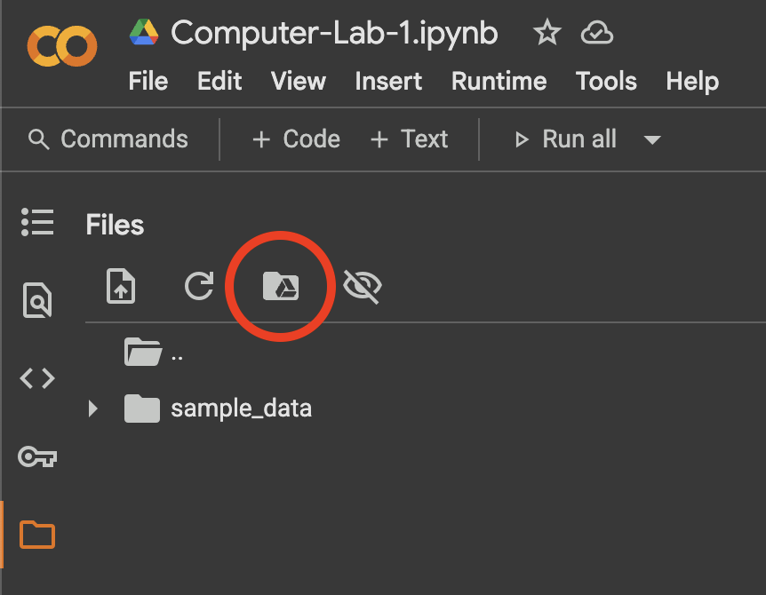
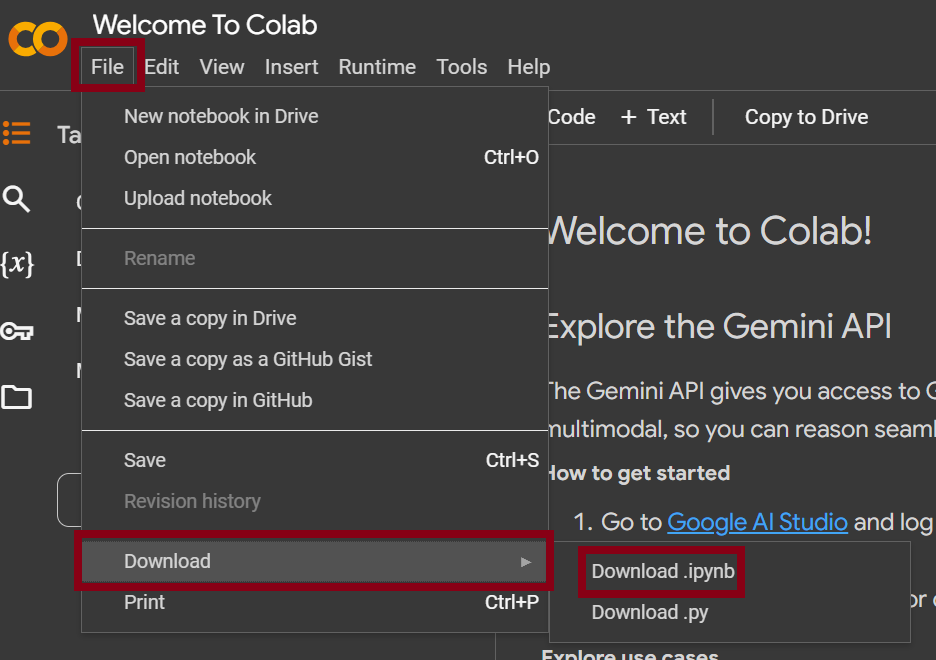

Welcome to the first computer lab. This session is designed to get everyone—regardless of prior experience—up to speed with the core concepts and coding practices in machine learning needed for the rest of the course. You will interact with an AI tutor via the Gemini CLI while implementing small machine learning exercises (PyTorch) in a Google Colab notebook.

You do NOT need previous ML experience. Come curious and ready to experiment.

> IMPORTANT: Do NOT close / exit the Gemini CLI (e.g. with `/exit` or Ctrl+C) before you save your chat history with `/chat save computer-lab-1` and copy the checkpoint file. If you exit first, the temporary session data can be lost and you will not be able to submit your chat transcript.

## Learning Goals

By the end of this lab you should be able to:

* Set up a reproducible workspace in Google Colab (and connect it to Google Drive).
* Use the Gemini CLI to follow an interactive AI‑guided tutorial and ask effective follow‑up questions.
* Run, adapt, and re‑run Python / PyTorch code blocks in Colab.
* Save and submit both: (a) your AI chat history, and (b) your executed notebook (`.ipynb`).

## Overview of the Workflow

1. Open a fresh Colab notebook and mount Google Drive.
2. Prepare a folder for this lab inside your Drive.
3. Download and place the provided `GEMINI.md` file in that folder.
4. Start the Gemini CLI, log in, and load the tutorial file.
5. Run the prompt `Start` inside the CLI to launch the guided session.
6. Copy generated code files into Colab cells, execute, and iterate.
7. Save your chat transcript and export your notebook.
8. Submit both using the form before the deadline.

## Getting Started

Open a new notebook in [Google Colab](https://colab.research.google.com/).

### Step-by-step Setup

1. Mount Google Drive. Click the folder icon in the left sidebar, then the Google Drive icon, choose your account, and grant permission (`See, edit, create, and delete all of your Google Drive files`).

	

2. A folder named `drive` now appears. Expand it to browse your Drive. Create or choose an empty folder dedicated to this lab. Right‑click it and copy its path.

3. Open the Colab terminal (bottom‑left > "Terminal" or via + icon depending on UI) and change into that folder:

```bash
cd "<path_to_your_folder>"
```

4. Download the file [`GEMINI.md`](https://drive.google.com/file/d/1_XqXAldRJKGDuTTLvOgRNhK67d2mRyxG/view?usp=drive_link) and drag it into that same Drive folder (or upload via the file pane). Ensure the filename is exactly `GEMINI.md`.


5. Start the Gemini CLI:

```bash
gemini
```

6. Log in with your Google account when prompted and follow the on‑screen instructions.

7. If the CLI exits after login, run `gemini` again to reopen it. The interface should display: `Using: 1 GEMINI.md file`.

8. At the prompt, type:

```
Start
```

This launches the interactive tutorial. Follow the AI tutor’s instructions carefully. When you need clarification, ask specific questions (e.g., *"Why do we zero gradients in PyTorch?"* rather than *"Explain more"*).

9. The Gemini CLI writes generated Python code to separate local files. Open each produced file’s contents and copy them into new Colab code cells, then run and experiment. Feel free to modify hyperparameters, add print statements, or time code segments.

After completing the tutorial (or reaching the session time limit), proceed to the submission steps below.


## Important tips for the computer lab

* Everyone starts from a different point—progress matters more than prior knowledge.
* Practice *learning how to learn*: formulate precise questions and iterate.
* Provide context when you ask the AI tutor (e.g., include error messages or the code snippet you changed).
* Ask for deeper or advanced topics if you finish early (e.g., *"Show me how to implement a custom PyTorch Dataset"*).
* Try independently first; if blocked, refine your prompt; then consult a TA.
* TAs will guide on process, tooling, or debugging strategy—not hand you final code.
* You can also ask for feedback on your prompts to improve your interaction technique.
* Keep your notebook tidy: interleave short markdown explanations of what each code block does.


### Tips for Google Colab

A notebook can contain Markdown (explanations) and Python code cells. To run a cell, click the play icon (triangle) at the left margin. While executing, a spinner shows progress. Upon completion, execution order numbers appear.

Your code runs on remote Google servers (CPU by default, a GPU can be enabled via Runtime > Change runtime type). This mirrors how large research clusters allocate compute nodes. You can install additional Python packages transiently within the session. Prepend a shell command with `!` (e.g. `!pip install torchmetrics`). These changes persist only for the current virtual machine. If the session restarts you may need to reinstall.

If you need a refresher, consult the Colab documentation: <https://colab.research.google.com/?utm_source=scs-index>. Additional hints will be provided in future labs.

## Deliverables

You must submit BOTH of the following:

1. Gemini CLI chat history (saved using the command below).
2. Executed Colab notebook (`.ipynb`) with outputs visible (avoid clearing outputs before download).

### Submission Instructions

To save your Gemini CLI chat history, inside the Gemini CLI type the command below BEFORE exiting:

```bash
/chat save computer-lab-1
```

You should see a confirmation message that a checkpoint file was written. Only AFTER that, end the session (`/exit` or Ctrl+C twice) if you wish.

Locate and copy the generated checkpoint JSON into your working folder (still in the Colab terminal):

```bash
cp /root/.gemini/tmp/*/checkpoint-computer-lab-1.json .
```

Verify it is present:

```bash
ls -l checkpoint-computer-lab-1.json
```


To save your Jupyter Notebook, follow these steps:

1. Click on "File" in the top menu.
2. Select "Download" and then choose "Download as .ipynb".




Then click the button below to upload BOTH your notebook and the (optionally renamed) chat history JSON file:



We would also appreciate if you can provide some feedback via the form to help us improve the course design.

### Submission Deadline

* Standard: submit before the end of the lab session.
* Grace period: you may submit within 24 hours after the session ends if you need additional time.
* Absence: if you cannot attend, obtain prior approval and still submit within 24 hours of the scheduled end.

## Grading

Evaluation components:

* Completion: core steps followed (mount, run tutorial, execute code, submission artifacts present).
* Engagement: evidence of exploratory modifications / markdown reflections.
* Clarity: readable notebook (section headers, brief explanations, organized cells).
* Peer Review: after the deadline you will be assigned two peers’ notebooks to review and provide constructive feedback (details forthcoming).

No points are deducted for initial mistakes. Iterate and document what you learned.

---
Questions during the lab? First try refining your prompt to the AI tutor. Still stuck? Then ask a TA with a concise summary: what you tried, what you expected, what happened.

Good luck and have fun exploring machine learning!
