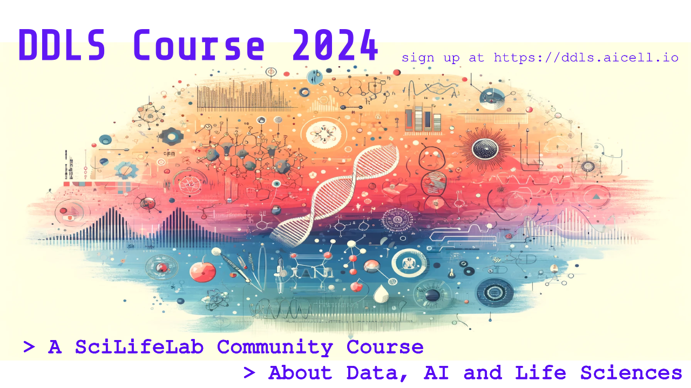

We are thrilled to announce the start of a new PhD course at KTH: **"Data-Driven Life Sciences"**. The course kicks off next week on August 28th and promises an enriching journey into data-driven approaches in life sciences, designed for both Master's and PhD-level students.
 - Master's: https://www.kth.se/student/kurser/kurs/SK2538
 - PhD: https://www.kth.se/student/kurser/kurs/FSK3538
 
 
Please also see the [course schedule](https://www.kth.se/social/course/SK2538/calendar/).

**Note: The actual schedule may change, please pay attention to in KTH canvas or email announcement**

---

## 🔍 What's New This Year?

This year, we're spicing things up by introducing **generative AI and ChatGPT** into the course curriculum! You'll get to learn how to harness the power of ChatGPT for coding, learning, and exploring various topics in life sciences. Plus, we'll dive deep into ethical discussions surrounding generative AI. 🤖

---

## 👩‍🔬 Course Highlights:

- **Learn about data-driven research** in structural biology, microscopy imaging, single-cell biology, multi-omics, and more.
  
- **Engage with guest lectures** from SciLifeLab DDLS fellows, and other experts in the field.
  
- **Practice coding skills** in Python and Jupyter Notebooks, focusing on various data analysis and modeling techniques relevant to life sciences.
  
- **Participate in seminars** and engage in discussions about data-driven approaches in scientific papers.

---

## 📝 Sign Up Now!

[Click here to enroll](https://forms.gle/T8gtrsJL3nf1Dqwf6) and take your research skills to the next level with this exciting course.

Feel free to share this opportunity with fellow master's and PhD students. Looking forward to seeing you in the course!

**Registration Deadline: Sept. 4th, 2023**
