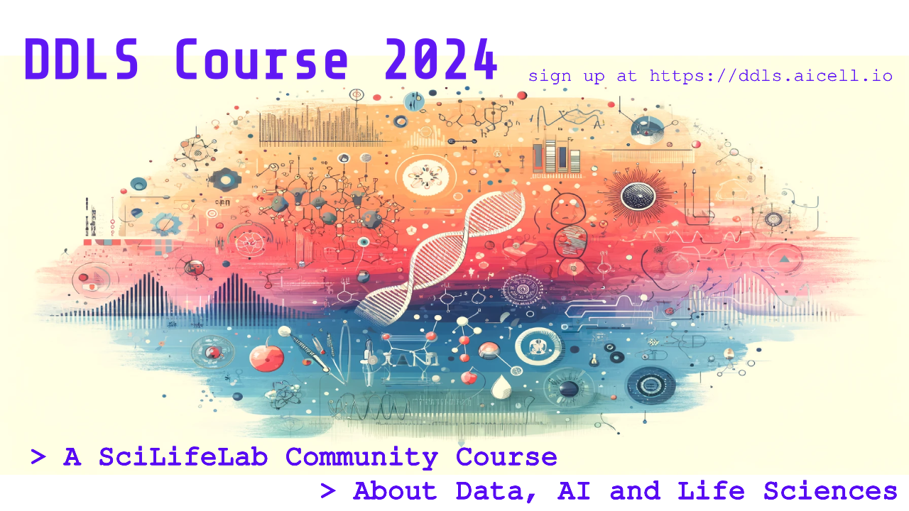

We are thrilled to announce the start of the new Data-Driven Life Sciences course for 2024, designed to explore the intersection of data science, artificial intelligence, and life sciences to drive innovation and discovery. This fully online course culminates in an in-person hackathon, fostering a vibrant community that gathers the DDLS and SciLifeLab members.

---

## What's New This Year?

This year, we're expanding the course to a national level in Sweden, welcoming master's students, PhD candidates, postdocs, and anyone interested in data-driven life sciences. The course will be conducted fully online, providing flexibility and accessibility for all participants.

Importantly, we are promoting this as a community course led by DDLS fellows and the SciLifeLab community, aiming to build a strong network of collaboration and knowledge sharing.

---

## Course Highlights:

- **Learn about data-driven research** in structural biology, microscopy imaging, single-cell biology, multi-omics, and more.
  
- **Engage with guest lecturers** from DDLS Fellows, SciLifeLab fellows, and other experts in the field.
  
- **Practice coding skills** in Python and Jupyter Notebooks, focusing on various data analysis and modeling techniques relevant to life sciences.
  
- **Participate in seminars** and engage in discussions about data-driven approaches in scientific papers.

---

## Sign Up Now!

[Click here to enroll](https://forms.gle/9gmxpEE6X6HZ1wLa7) and take your research skills to the next level with this exciting course.

Feel free to share this opportunity with fellow master's and PhD students. We look forward to seeing you in the course!

**Registration Deadline: Aug 19, 2024**

---

## Course Details

**Start date:** August 27th, 2024 (week 35)  
**End date:** October 11th, 2024 (week 40)  
**Format:** Online over Zoom  
**Duration:** 1 Module/week
**Schedule**: https://ddls.aicell.io/course/ddls-2024/schedule/
**Frequency:** One Module spans 3 days in a week (approximately 24-30 hours for a Module)  
**Venue:** Online  
**Topic/Category:** Data-driven Life Science, Data Science, AI, Lab Automation, Bioinformatics, Bioimaging, Precision Medicine, Biodiversity, Epidemiology, Infection  
**Organizer:** Wei Ouyang (DDLS fellow) in collaboration with the SciLifeLab DDLS education and training hub  
**Course leader:** Dr. Wei Ouyang <weio@kth.se>  
**Teaching Assistants:** Nils Mechtel <nils.mechtel@scilifelab.se>, Songtao Cheng <songtao.cheng@scilifelab.se>  
**Audience:** Master students, PhD students, post-docs, researchers with an interest in Data-driven Life Sciences  

---

## Intended Learning Outcomes

By the end of this course, you will be able to:
- Describe the field of data-driven life sciences
- Present an overview of various application areas
- Provide examples of applications and their associated analysis methods
- Apply statistical and machine learning analysis to biological data sets
- Formulate models of biological phenomena
- Present and review scientific literature in computer-driven life sciences
- Reflect on the ethical consequences of data-driven life sciences
- Practice good data management, including collection, handling, sharing, and analysis

---

## Course Format and Credits

The course consists of 6 modules: a basic module and 5 elective modules. Each module is a stand-alone short-form course with 3 sessions per module. Completing all 6 modules earns a total of 7.5 ECTS.

**Modules and Certification:**
Module 1 (basic module) is a prerequisite for obtaining certification for attendance in any of the subsequent elective modules. To receive a certificate, you must:
- Apply for and participate in Module 1.
- Actively participate in all registered modules by attending and engaging in all sessions.

You will receive 0.5 ECTS for the basic module and 1 ECTS for each elective module. Completing a final project earns an additional 2 ECTS. For example, if you are a PhD student interested in Module 2, you must complete both Module 1 and Module 2 to receive 0.5 + 1 ECTS. Master's students from KTH or other universities must complete the entire course, including the basic and elective modules, plus the final project.

The first module covers course basics and prerequisites. The subsequent modules each run for a week and cover various topics in data-driven life sciences (DDLS). Each week includes three main activities:
- One or two 2-hour lectures on Tuesday providing background information about the week's topic(s)
- A computer lab on Wednesday for practical data exploration using Python in Jupyter notebooks (Google Colab)
- A seminar on Friday for collective explanation and discussion of an assigned research paper

**Self-directed Learning:**
One of the principal objectives of this course is to instill in you a data-driven mindset essential for life science research. More importantly, we aim to teach you the art of "learning how to learn." This involves honing your ability to independently acquire new knowledge and skills. ChatGPT serves as an excellent tool to facilitate this self-directed learning process. Instead of focusing solely on the course content, we encourage you to embrace this broader, skill-centric approach to education. We will use this self-directed learning approach extensively in the computer lab and journal club sessions.

---

## Important Links

- [Course Schedule](https://ddls.aicell.io/course/ddls-2024/schedule/)
- [Registration Link](https://forms.gle/9gmxpEE6X6HZ1wLa7)

### Course Fee: Free
There is no course attendance fee.

### Selection Criteria
The applicants should be equipped with basic knowledge in life science and basic Python programming skills.

### Important Dates
- **Application open:** June 5th, 2024
- **Application closes:** Aug 19, 2024
- **Confirmation to applicants:** Approximately a week after the deadline

For further questions, please contact the course leader Dr. Wei Ouyang <weio@kth.se> and <traininghub@scilifelab.se>.
